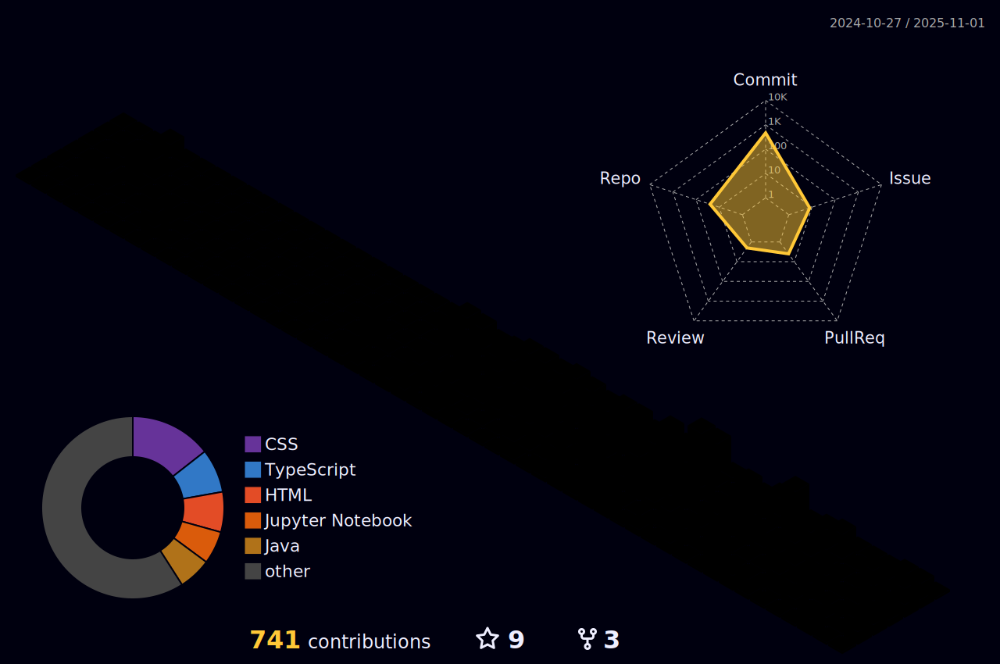

<h1 align="center">Nicolas Arthur</h1>

AI Software Developer | AI & Systems Enthusiast | ADS Student at IFSC

---

## About Me

Hi! My name is Nicolas Arthur. I work in Florianópolis, Brazil, at Alvarez & Marsal as AI Software Developer.

---

---
g

## Featured Projects

<strong><a href="https://github.com/Projeto-Site-do-Museu/ifsc-museu-saojose">Museu Histórico de São José</a></strong>

A modern and responsive landing page for a historical museum:

- Developed using **Next.js**, **Tailwind CSS**, and **Three.js**
- Includes a fully interactive **3D virtual tour** experience
- Designed to improve digital presence and user engagement through immersive UX

Delivered as a real-world project focusing on accessibility, performance, and interactivity.

<strong><a href="https://nicolasarthurdev.github.io/songlub/">Songlub</a></strong>

Songlub is a music studio club that offers music courses and activities. The web system must manage the registration of students/practicing musicians and their payments for enrollment and monthly fees.

Repo: https://github.com/NicolasArthurDev/songlub

<strong><a href="https://github.com/NicolasArthurDev/clovis">C.L.O.V.I.S – Intelligent Virtual Assistant</a></strong>

**C.L.O.V.I.S (Contextual Language-Oriented Virtual Interactive System)** is an AI-powered virtual assistant designed as a modular, customizable system with:

- Local **LLM** integration and prompt engineering
- Context-aware **memory** architecture with persistent storage
- Real-time **voice interaction** using speech-to-text and text-to-speech
- Web-based UI built with **Streamlit**

This project demonstrates applied knowledge in **NLP**, **LLM orchestration**, and real-time human-machine interaction using open-source tools.

<strong><a href="https://github.com/Evolutionary-Coders/neural-hunter">NeuralHunter – Autonomous Combat Bot</a></strong>

A self-learning robot that uses:

- **Reinforcement Learning** and Neural Networks, built in **Java**
- Adaptation to enemy behavior in the **Robocode** simulation environment
- Focus on decision-making, pattern recognition, and strategy evolution

This was developed as part of a group AI and game logic exploration initiative.

More projects available at: [nicolasarthurdev.github.io](https://nicolasarthurdev.github.io)

---

## Education

**System Analysis and Development (ADS)**  
Federal Institute of Santa Catarina – IFSC  
2024.2 – 2026.2

---

## Get in Touch

- LinkedIn: [linkedin.com/in/nicolas-arthur-raulino-oliveira](https://linkedin.com/in/nicolas-arthur-raulino-oliveira)  
- Portfolio: [nicolasarthurdev.github.io](https://nicolasarthurdev.github.io)

---

  

  
  

